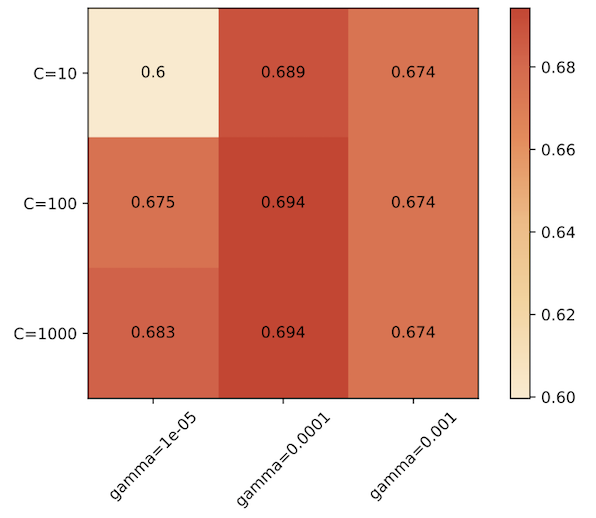
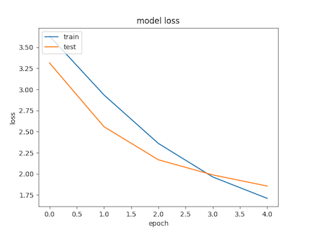
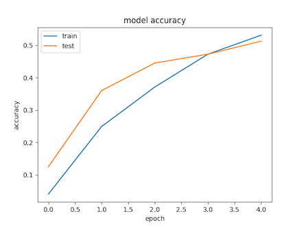
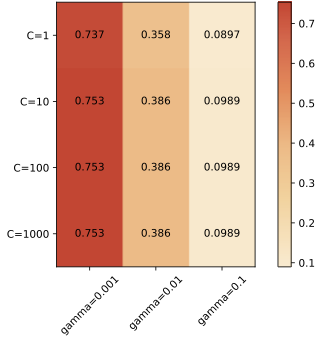
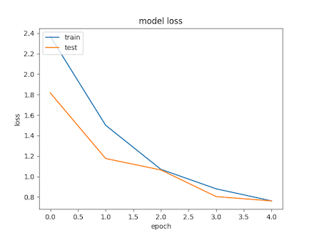

# Sketch Recognition

A SVM based machine learning program for human sketch recognition based on [How Do Humans Sketch Objects? (Eitz et al. 2012)](http://cybertron.cg.tu-berlin.de/eitz/projects/classifysketch/).

<span>          </span>

## Installation

### Mac/Linux

- install [python 3 :snake:](https://www.python.org/downloads/)
- install [anaconda :snake:](https://conda.io/docs/user-guide/install/index.html)

```bash
conda env create -f anaconda/environment.yml
source activate sketch-recoginition
```

- run `sudo apt-get install unzip`
- `cd` into project folder in terminal
- run `/install.sh`


### Windows

:alien:

## Train SVM

### TU-Berlin Sketch Dataset

The number of categories is currently set to 40 (see folder names in `/tu-train`) in order to reduce training time (about 15 minutes).
Each category consists of 70 training sketches (located in `/tu-train`) and 10 testing sketches (located in `/tu-test`).

```bash
python train_svm_tu.py
```

In order to **change or extend the categories**, follow these steps: 

- install [Imagemagick](www.imagemagick.org/script/download.php)
- run `load_all_tu_sketches.sh` to download all sketches collected by [How Do Humans Sketch Objects? (Eitz et al. 2012)](http://cybertron.cg.tu-berlin.de/eitz/projects/classifysketch/) into folder `/img-all`
- delete folders in `/tu-train`
- copy all categories you want to train into `/tu-train`
- run `./resize.sh` in folder `/tu-train` as soon as you have finished copying. 10 sketches of each category will be moved for testing
- train the SVM (see above)

### Google QuickDraw Dataset

Google provides a massive amount of sketches through the QuickDraw Dataset which can be used to train the SVM as well. In this repository, 14 categories are used to train the SVM. 290 sketches of each category are are used to train and 10 are used to test the SVM. This decision was made due to the lower quality and lower resolution (28x28) of the dataset.

```bash
python train_svm_quickdraw.py
```

In order to **change or extend the categories**, follow these steps: 

- download a number of categories from https://console.cloud.google.com/storage/browser/quickdraw_dataset/full/numpy_bitmap into `/quickdraw-ds`
- rename files to `<category>.npy`
- run `python reduce.py` in `/quickdraw-ds` to extract and export the first 300 sketches (290 train and 10 test images). The original files in `/quickdraw-ds` can be deleted afterwards
- train the SVM (see above)

### Using Pre-Trained SVM Models

Trained models are saved in the `models/` folder for later use.
To reuse a pre-trained model, run `python use_svm_model.py -m "models/file.sav"` (change model file accordingly)
If the model was trained with Google Quickdraw data, add `-q`

## CNN (Convolution Neural Network) Architectures

### Architecture 1 - Sketch-A-Net CNN

The Architecture is implemented as described in [Sketch-a-Net that Beats Humans (Yu et al. 2015)](https://arxiv.org/pdf/1501.07873.pdf)
The Input size is set to 225x255 pixels

|   | Input       | Filter Size | Filter Num | Stride | Padding |  Output |
|---|-------------|:-----------:|:----------:|:------:|:-------:|:-------:|
| 0 | Conv        |             |            |        |         | 225x225 |
| 1 | Conv(ReLU)  |    15x15    |     64     |    3   |    0    |  71x71  |
|   | MaxPool     |     3x3     |            |    2   |    0    |  35x35  |
| 2 | Conv(ReLU)  |     3x3     |     128    |    1   |    0    |  31x31  |
|   | MaxPool     |     3x3     |            |    2   |    0    |  15x15  |
| 3 | Conv(ReLU)  |     3x3     |     256    |    1   |    1    |  15x15  |
| 4 | Conv(ReLU)  |     3x3     |     256    |    1   |    1    |  15x15  |
| 5 | Conv(ReLU)  |     3x3     |     256    |    1   |    1    |  15x15  |
|   | MaxPool     |     3x3     |            |    2   |    0    |   7x7   |
| 6 | Conv(ReLU)  |     7x7     |     512    |    1   |    0    |   1x1   |
|   | Dropout 0.5 |             |            |        |         |   1x1   |
| 7 | Conv(ReLU)  |     1x1     |     512    |    1   |    0    |   1x1   |
|   | Dropout 0.5 |             |            |        |         |   1x1   |
| 8 | Conv (ReLU) |     1x1     |     250    |    1   |    0    |   1x1   |


### Archtecture 2 - Adapted Sketch-a-Net CNN

To adapt for lower sketch size, the Network has been adapted (lower filter sizes, lower number of filters)

|   | Input       | Filter Size | Filter Num | Stride | Padding |  Output |
|---|-------------|:-----------:|:----------:|:------:|:-------:|:-------:|
| 0 | Conv        |             |            |        |         |  28x28  |
| 1 | Conv(ReLU)  |     2x2     |     32     |    3   |    0    |  28x28  |
|   | MaxPool     |     3x3     |            |    2   |    0    |  14x14  |
| 2 | Conv(ReLU)  |     3x3     |     64     |    1   |    0    |  14x14  |
|   | MaxPool     |     3x3     |            |    2   |    0    |   7x7   |
| 3 | Conv(ReLU)  |     3x3     |     128    |    1   |    1    |   5x5   |
| 4 | Conv(ReLU)  |     3x3     |     128    |    1   |    1    |   3x3   |
| 5 | Conv(ReLU)  |     3x3     |     128    |    1   |    1    |   1x1   |
|   | MaxPool     |     3x3     |            |    2   |    0    |   1x1   |
| 6 | Conv(ReLU)  |     3x3     |     256    |    1   |    0    |   1x1   |
|   | Dropout 0.5 |             |            |        |         |   1x1   |
| 7 | Conv(ReLU)  |     1x1     |     256    |    1   |    0    |   1x1   |
|   | Dropout 0.5 |             |            |        |         |   1x1   |
| 8 | Conv (ReLU) |     1x1     |     256    |    1   |    0    |   1x1   |
| 9 | Flatten     |             |            |    1   |    0    |   1x1   |
| 10| Dense       |             |            |        |         |   15    |

### Archtecture 3 - Fashion CNN

This network was proposed in class to classify clothes and it was found to be useful for sketches as well, although further alignments are needed.

|   | Input          | Filter Size | Filter Num | Stride | Padding |  
|---|----------------|:-----------:|:----------:|:------:|:-------:|
| 0 | Conv           |             |            |        |         |
| 1 | Conv(ReLU)     |     3x3     |     32     |    1   |    0    |
| 2 | Conv(ReLU)     |     3x3     |     32     |    1   |    1    |
|   | MaxPool        |     2x2     |            |    1   |    1    |
|   | Dropout 0.25   |             |            |        |         |
| 3 | Conv(ReLU)     |     3x3     |     64     |    1   |    0    |
| 4 | Conv(ReLU)     |     3x3     |     64     |    1   |    1    |
|   | MaxPool        |     2x2     |            |    1   |    1    |
|   | Dropout 0.25   |             |            |        |         |
| 5 | Flatten        |             |            |    1   |    0    |
| 6 | Dense(softmax) |             |            |        |         |

## Train CNN

The model type in defined in the python files. Uncomment and comment the respective lines to use another model.

Train with TU Dataset

```bash
python train_cnn_tu.py
```

Train with Google Quickdraw Dataset

```bash
python train_cnn_quickdraw.py
```

## Results

### TU-Berlin Sketch Dataset

#### SVM

| Nr.   | Type | keypoints       | C                |    gamma            | Kernel  | score | best  |
|-------|------|-----------------|:----------------:|:-------------------:|:-------:|:-----:|:-----:|
| 1     | SVM   | 150x150x50     | 1, 10, 100, 1000 | -                   | linear  | 0.63  | same   |
| 2     | SVM   | 150x150x**30** | 1, 10, 100, 1000 | -                   | linear  | 0.67  | same   |
| **3** | SVM   | 150x150x30     | 10, 100, 1000    | .00001, .0001, .001 | **rbf** | 0.69  | gamma : 0.0001, C: 100   |

**Best Result : #3**



#### CNN

In every case, the whole set of 2800 sketches with 28x28 pixel vectors were passed to the network. Hyperparams where chosen as Epochs: 5, Batch Size: 128

| Nr.   | Network              | Test Score | Test Accuracy | 
|-------|----------------------|:----------:|:-------------:|
| 1     | Sketch-a-Net         | 3.608       | 0.04          |
| 2     | Adapted Sketch-a-Net | 3.42       | 0.07          |
| **3** | Fashion Net          | **1.86**   | **0.51**      |

**Best Result : #3**

 


### Google QuickDraw

#### SVM

| Nr.   | Type | keypoints    | C                |    gamma            | Kernel     | score | best                |
|-------|------|--------------|:----------------:|:-------------------:|:----------:|:-----:|:-------------------:|
| 1     | SVM   | 28x28x14    | 1, 10, 100       | .001, .01           | rbf        |  0.63 | gamma: 0.001, C: 10 |
| **2** | SVM   | 28x28x**7** | 1, 10, 100, 1000 | .001, .01, .1       | rbf        |  0.75 | gamma: 0.001, C: 10 |
| 3     | SVM   | 28x28x7     | 1, 10, 100       | .0001, .001         | **linear** |  0.63 | gamma: 0.001, C: 10 |

**Best Result : #2**



#### CNN

In every case, the whole set of 4046 sketches with 28x28 pixel vectors were passed to the network. Hyperparams where chosen as Epochs: 5, Batch Size: 128

| Nr.   | Network              | Test Score | Test Accuracy | 
|-------|----------------------|:----------:|:-------------:|
| 1     | Sketch-a-Net         | 1.98       | 0.31          |
| 2     | Adapted Sketch-a-Net | 1.67       | 0.47          |
| **3** | Fashion Net          | **0.76**   | **0.78**      |

**Best Result : #2**

 


## Credits and Thanks

The implementation of the SVM and CNN is based on the exercise code provided by [Prof. Dr.-Ing. Kristian Hildebrand](http://hildebrand.beuth-hochschule.de/#/)

The SVM approach is described in [How Do Humans Sketch Objects? (Eitz et al. 2012)](http://cybertron.cg.tu-berlin.de/eitz/projects/classifysketch/)

The CNN approach is described in [Sketch-a-Net that Beats Humans (Yu et al. 2015)](https://arxiv.org/pdf/1501.07873.pdf)

## TODO

- [ ] overlapping keypoints
- [ ] adapt Neural Networks to achieve better test resultss
- [ ] tidy up scripts and folders
